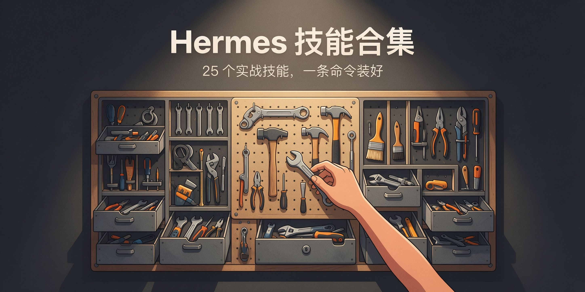

<div align="center">

# Hermes 技能合集

**25 个实战验证的 Agent 技能，一条命令装好——不用逐个 clone。**


[它解决什么问题](#它解决什么问题) - [为什么比分散仓强](#为什么比分散仓强) - [技能清单](#技能清单) - [快速开始](#快速开始)

</div>

---

## 它解决什么问题

我在日常 AI 协作中沉淀了一批可复用的方法论：B站视频总结、KOL 内涵提炼、规则审计、任务队列、cron 时区排查、新能源售后知识管理……每个都是踩过坑、跑通过的。问题是它们分散在脑子里或独立小仓里，换个环境要逐个 clone、逐个装，还容易漏。需要一个统一入口，把这些技能一次拉齐、一条命令装好。

## 为什么比分散仓强

| 逐个找仓安装 | 本仓库合集 |
|---|---|
| 25 个仓逐个 clone | `bash install-all.sh` 一次全装到 `~/.hermes/skills` |
| 分散更新，版本漂移 | 同一 repo 一次 pull 全部更新 |
| 只要其中一个也得全拉 | `bash install-one.sh <name>` 按需装单个 |
| 别人搜 Hermes 技能逐个找 | 合集页是统一入口，一次看到全部 |

## 技能清单

### 工具与流程

| 技能 | 说明 |
|------|------|
| `bilibili-watchlater-summarizer` | B站稍后再看视频总结→飞书文档 |
| `bilibili-api-patterns` | B站API调用模式与反ban策略 |
| `research-first-protocol` | 先研究后动手，禁止边做边试错 |
| `autonomous-problem-solving` | 自主问题排查与解决 |
| `rules-audit` | 规则审计与一致性检查 |
| `session-task-audit` | 会话任务审计 |
| `task-queue-protocol` | 任务队列协议 |
| `cron-timezone-pitfall` | 定时任务时区陷阱 |
| `docker-container-ops` | Docker容器操作 |
| `hermes-config-workflow` | Hermes配置修改正确姿势 |
| `external-skill-adoption` | 外部技能学习与吸收规范 |

### 内容生产

| 技能 | 说明 |
|------|------|
| `brand-style-research` | 品牌风格调研 |
| `kol-content-research` | KOL内容调研 |
| `web-intelligence-reports` | 网络情报报告 |
| `xiaohongshu-account-operations` | 小红书账号运营 |
| `xiaohongshu-comment-leads` | 小红书评论线索挖掘 |
| `douyin-realestate-research` | 抖音房产内容调研 |
| `travel-deal-research` | 旅行优惠调研 |
| `movie-resource-automation` | 影视资源自动化 |
| `media-resource-automation` | 媒体资源自动化 |

### 垂直领域

| 技能 | 说明 |
|------|------|
| `ev-after-sales-knowledge-management` | 新能源售后知识管理 |
| `automotive-job-hunting-framework` | 汽车行业求职框架 |
| `psycho-career-coach-model` | 职业心理教练模型 |
| `document-content-search` | 文档内容检索 |
| `ima-knowledge-base` | IMA知识库操作 |
| `n8n-dify-deepseek-workflow` | n8n+Dify+DeepSeek工作流 |

## 快速开始

```bash
git clone https://github.com/ninggui/hermes-skills-collection.git
cd hermes-skills-collection

bash install-all.sh                        # 全部安装到 ~/.hermes/skills
bash install-one.sh bilibili-api-patterns  # 只装单个
```

## License

MIT
